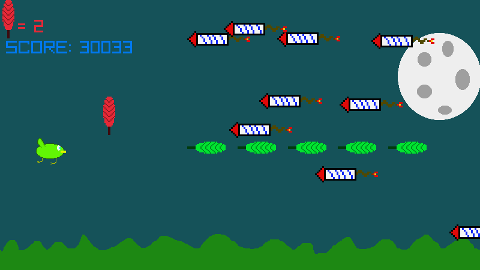

# Avoid
A dumb raylib test which you can play [here](https://canneddonuts.itch.io/avoid-the-game)

##  To-do
- a build guide
- multiple stages
- a tutorial

## Note
This games code more specifically 'Main.c' is a retyped version of this [repo](https://github.com/raysan5/raylib-game-template) which is code under the zlib license.

## Preview

